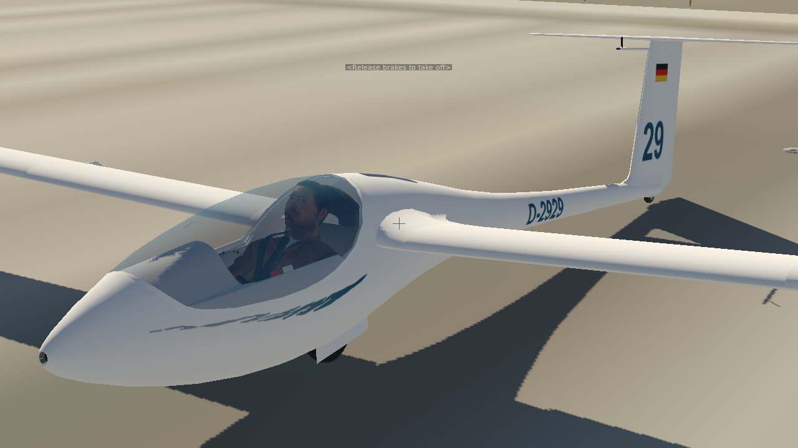
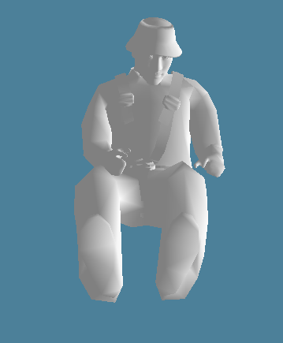

# X-Plane pilot models

This is a mod to an existing pilot model.

Available with and without headphones, the entire seat strap, or without just the lower
part of the seat strap which tends to poke out the side of some aircraft (i.e. gliders).

## Usage

Add this 'pilot' directory to an 'objects' folder in your aircraft folder.

For your aircraft, you *only* need the `<choice>.obj`, `pilot.dds` and `pilot_NRM.png`

Using Plane Maker, add the chosen pilot model (e.g. pilot.obj) as the FIRST object
in 'Misc Objects'.

Suggested starting positioning is: 1.25, 0.85, 1.25 with a heading of 1 and a pitch of 29.

## The surgery technique...

The `pilot.ods` file is a Libreoffice spreadsheet containing the original .obj data with a bunch of XY scatterplots
that allowed me to search through the file to find which rows contain the x,y,z points relevant to the headphones and seat
belt. Anyone sensible would use Sketchup and one day I'll get off my ass and learn it. I include it here in case it helps anyone.

## Credits

B21 did the model surgery

unrealaviation worked out the 'first entry in the Misc Objects' technique and provided the coordinates.

Laminar for original 'glider_pilot.obj' model

